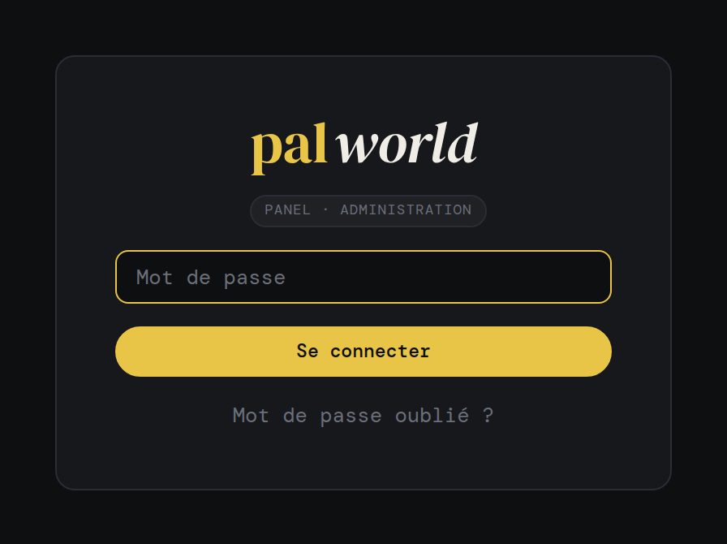

# 🔐 Connexion du panel — guide pour les développeurs / administrateurs

> **À qui ce document s'adresse :** aux personnes qui **déploient ce projet**
> (fork ou installation) et veulent y **ajouter / mettre à jour** le système de
> connexion. Ce fichier est fait pour être **partagé tel quel** — il n'est pas
> publié sur le site du panel.

Il explique comment **mettre à jour** un panel existant pour bénéficier du
système de connexion, comment **changer** et **réinitialiser** le mot de passe,
comment activer l'**auto-login Cloudflare**, et surtout les **pièges à éviter**.

## Ce que change le nouveau système

- **Un seul compte** : `admin`, protégé par mot de passe. La création/suppression
  de comptes multiples a été retirée.
- **Auto-login via Cloudflare Access** (optionnel) : si tu accèdes au panel
  derrière Cloudflare (login Google), tu es connecté **automatiquement**, sans
  ressaisir le mot de passe. En accès direct sur le réseau local (LAN), le mot de
  passe reste demandé — la porte LAN reste protégée.
- **Tous les onglets accessibles** : plus de distinction de droits par page.

---

## À livrer — les 3 composants du système de connexion

Pour que **tous les déploiements se ressemblent** et restent dépannables, le
système de connexion se compose de **trois pièces indissociables**. Ne livre
pas la page de login sans les deux autres :

1. **La page de connexion** (`templates/login.html`) — l'écran ci-dessous.
2. **La page « Mot de passe oublié »** (`templates/forgot.html`), servie sur
   `/mot-de-passe-oublie` et atteignable par le lien en bas de la connexion.
3. **Le script de réinitialisation** (`scripts/reset-admin-password.sh`),
   déployé sur la VM — c'est le **seul recours** si le mot de passe est perdu
   et qu'il n'y a pas d'auto-login Cloudflare (voir §3).

> ⚠️ **Le lien « Mot de passe oublié ? » sur la page de connexion n'est pas
> décoratif** : sans la page `/mot-de-passe-oublie` **et** sans le script sur
> la VM, un mot de passe oublié = panel définitivement inaccessible. Les trois
> vont ensemble.

---

## La page de connexion — à reproduire à l'identique

Pour que **tout le monde ait la même tête de connexion**, voici l'écran de
référence. Reproduis-le tel quel (mêmes éléments, même charte) :



Éléments obligatoires, dans cet ordre :

- **Logotype** `pal` (doré `#e8c547`, serif **DM Serif Display**) + `world`
  (blanc, serif italique) — minuscules, collés.
- **Badge** `panel · administration` (mono **DM Mono** en majuscules, chip
  translucide arrondie).
- **Champ mot de passe** unique (`type="password"`, `name="password"`,
  `autofocus`) — pas de champ « nom d'utilisateur » (un seul compte `admin`).
- **Bouton `Se connecter`** pleine largeur, fond doré (`.btn.primary.full`).
- **Lien `Mot de passe oublié ?`** sous le bouton → `/mot-de-passe-oublie`.
- Fond quasi noir `#0e0f11`, carte centrée (rayon 12 px). Les polices sont
  **embarquées en base64** (`static/fonts.css`) : la connexion s'affiche
  **hors ligne**, sans police Google.

> 💡 Toutes les couleurs viennent du bloc `:root` de `static/style.css`. Ne
> code jamais une couleur en dur ici : réutilise les variables (`--accent`,
> `--bg`, etc.) pour rester dans la charte.

---

## 1. Mettre à jour le panel

### Le plus simple — depuis le panel
1. Ouvre le panel → onglet **Maintenance**.
2. Clique **Mettre à jour le panel**. Il récupère la dernière version depuis
   GitHub et redémarre tout seul.
3. Recharge la page (au besoin, rechargement forcé : `Ctrl + Shift + R`).

### En ligne de commande (sur la VM)
```bash
cd /opt/palworld-src        # dossier du dépôt (adapte si besoin)
sudo -u palworld git pull
sudo systemctl restart palworld-panel
```

---

## 2. Changer le mot de passe du compte admin

Depuis le panel :
1. Onglet **Paramètres**.
2. Bloc **« Mot de passe du panel »**.
3. Saisis le nouveau mot de passe (**8 caractères minimum**) → **Changer le mot
   de passe**.

C'est ce mot de passe qui protège l'accès **direct sur le réseau local**.

---

## 3. Réinitialiser le mot de passe oublié

Si tu ne peux plus te connecter (mot de passe oublié **et** pas d'auto-login
Cloudflare), lance ce script **sur la VM** (console Proxmox ou SSH) :

```bash
sudo bash /opt/palworld/scripts/reset-admin-password.sh
```

- Il demande un **nouveau mot de passe** (ou passe-le en argument :
  `sudo bash /opt/palworld/scripts/reset-admin-password.sh 'MonNouveauMDP'`).
- Il réécrit le compte `admin` et remet les bons droits sur le fichier.
- Reconnecte-toi ensuite sur le panel avec ce nouveau mot de passe.

> 💡 **Astuce de secours** : supprimer le fichier des comptes
> (`sudo rm /opt/palworld/panel-users.json` puis
> `sudo systemctl restart palworld-panel`) remet le mot de passe **d'origine**
> défini à l'installation (dans `/etc/palworld-panel/config.json`). Le script
> ci-dessus est préférable car tu choisis un nouveau mot de passe.

---

## 4. (Optionnel) Activer l'auto-login Cloudflare

Si ton panel est publié derrière **Cloudflare Access** avec un login Google :

1. Onglet **Paramètres** → bloc **« Connexion Google (Cloudflare) »**.
2. (Facultatif) Renseigne **ton email Google** pour n'autoriser l'auto-login
   qu'à toi. Laisse vide pour accepter tout email déjà validé par Cloudflare.
3. Enregistre. En arrivant par Cloudflare, tu seras connecté automatiquement.

> ⚠️ **Sécurité** : l'auto-login fait confiance à l'en-tête ajouté par
> Cloudflare. Sur le LAN, cet en-tête est absent (le mot de passe reste
> demandé), mais un appareil malveillant **sur ton réseau** pourrait le
> falsifier. Pour un usage maison, le risque est faible ; garde un mot de passe
> solide sur le compte admin.

---

## 5. ⚠️ À éviter — pièges et leçons apprises

Des erreurs rencontrées en construisant ce système. Évite-les :

- ❌ **Ne supprime pas complètement le login.** Le panel reste accessible en
  **direct sur le LAN** (ex. `http://192.168.0.221:8080`), sans passer par
  Cloudflare. Sans mot de passe, **n'importe qui sur ton réseau** aurait un
  accès total (arrêt du serveur, mots de passe affichés dans **Infos**…).
  Garde le login ; utilise l'**auto-login Cloudflare** pour le confort.
- ⚠️ **Cloudflare ne protège que le domaine public, pas l'IP LAN.** Ne te
  repose pas uniquement dessus pour la sécurité — garde un **mot de passe admin
  solide**.
- ⚠️ **L'auto-login via l'en-tête Cloudflare est falsifiable sur le LAN.**
  Renseigne ton **email autorisé** dans Paramètres et garde un bon mot de passe.
- ⚠️ **Cache Cloudflare** : ne mets pas de règle « Cache Everything » sans
  **exclure `/api/*`**, sinon le panel affiche des données **périmées** (statut
  « Hors ligne » alors que le serveur tourne). Le panel envoie déjà `no-store`
  sur l'API, mais une règle trop large peut le contourner.
- ⚠️ **La Console temps réel (flux SSE) passe mal par Cloudflare** (mise en
  mémoire tampon). Si elle ne défile pas via le tunnel, utilise-la en **accès
  LAN**.
- ⚠️ **Ne réécris pas `panel-users.json` en root sans rétablir les droits.**
  Le panel tourne sous l'utilisateur `palworld` et doit pouvoir réécrire ce
  fichier ; le script `reset-admin-password.sh` remet les bons droits tout seul.
- ⚠️ **Ne modifie pas `config.json` ni le monde sauvegardé à la main.** Passe par
  le panel (Configuration, Sauvegardes) ; les réinstallations sont idempotentes
  et **n'écrasent pas** le monde.
